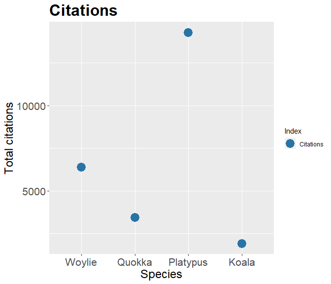

# specieshindex

`specieshindex` is a package that aims to guage scientific influence
mainly using the h-index.

## Installation

To get this package to work, make sure you have the following packages
installed.

``` r
install.packages("rscopus")
install.packages("taxize")
install.packages("XML")
install.packages("httr")
install.packages("dplyr")
install.packages("rlang")
devtools::install_github("jessicatytam/specieshindex", force = TRUE, build_vignettes = TRUE)

library(taxize)
library(httr)
library(XML)
library(rscopus)
library(specieshindex)
```

## Getting Scopus API key

To connect and download citation information from Scopus legally, you
will absolutely need an API key. Here are the steps to obtain the key.
1. Go to <https://dev.elsevier.com/> and click on the button `I want an
API key`. 2. Create an account and log in. 3. Go to the `My API Key` tab
on top of the page and click `Create API Key`. 4. Read the legal
documents and check the boxes.

## Simple example

Here is a quick demonstration of how the package works. Let’s say you
want to compare the species h-index of a few marsupials. First, you
would need to download the citation information using either
`FetchSpT()` for title only or `FetchSpTAK()` for
title+abstract+keywords. Remember to use binomial names.

``` r
Woylie <- FetchSpTAK("Bettongia", "penicillata", myAPI)
Quokka <- FetchSpTAK("Setonix", "brachyurus", myAPI)
Platypus <- FetchSpTAK("Ornithorhynchus", "anatinus", myAPI)
Koala <- FetchSpTAK("Phascolarctos", "cinereus", myAPI)
```

Now that you have the data, you can use the `Allindices()` function to
create a dataframe that shows their indices.

``` r
W <- Allindices(Woylie, genus = "Bettongia", species = "penicillata")
```

    ## 
    ## Attaching package: 'dplyr'

    ## The following object is masked from 'package:testthat':
    ## 
    ##     matches

    ## The following objects are masked from 'package:stats':
    ## 
    ##     filter, lag

    ## The following objects are masked from 'package:base':
    ## 
    ##     intersect, setdiff, setequal, union

    ## 
    ##  Bettongia penicillata 
    ##  113 publications 
    ##  1903 citations 
    ##  55 journals 
    ##  110 articles 
    ##  3 reviews 
    ##  43 years of publishing 
    ##  h: 26 
    ##  m: 0.6046512 
    ##  i10: 54 
    ##  h5: 7

``` r
Q <- Allindices(Quokka, genus = "Setonix", species = "brachyurus")
```

    ## 
    ##  Setonix brachyurus 
    ##  242 publications 
    ##  3427 citations 
    ##  107 journals 
    ##  237 articles 
    ##  5 reviews 
    ##  66 years of publishing 
    ##  h: 29 
    ##  m: 0.4393939 
    ##  i10: 121 
    ##  h5: 4

``` r
P <- Allindices(Platypus, genus = "Ornithorhynchus", species = "anatinus")
```

    ## 
    ##  Ornithorhynchus anatinus 
    ##  321 publications 
    ##  6365 citations 
    ##  153 journals 
    ##  308 articles 
    ##  13 reviews 
    ##  67 years of publishing 
    ##  h: 41 
    ##  m: 0.6119403 
    ##  i10: 177 
    ##  h5: 7

``` r
K <- Allindices(Koala, genus = "Phascolarctos", species = "cinereus")
```

    ## 
    ##  Phascolarctos cinereus 
    ##  773 publications 
    ##  14291 citations 
    ##  227 journals 
    ##  744 articles 
    ##  29 reviews 
    ##  139 years of publishing 
    ##  h: 53 
    ##  m: 0.381295 
    ##  i10: 427 
    ##  h5: 14

``` r
CombineSp <- rbind(W, Q, P, K) #combining the citation records
CombineSp
```

    ##              genus_species     species           genus publications citations
    ## 1    Bettongia_penicillata penicillata       Bettongia          113      1903
    ## 2       Setonix_brachyurus  brachyurus         Setonix          242      3427
    ## 3 Ornithorhynchus_anatinus    anatinus Ornithorhynchus          321      6365
    ## 4   Phascolarctos_cinereus    cinereus   Phascolarctos          773     14291
    ##   journals articles reviews years_publishing  h         m i10 h5
    ## 1       55      110       3               43 26 0.6046512  54  7
    ## 2      107      237       5               66 29 0.4393939 121  4
    ## 3      153      308      13               67 41 0.6119403 177  7
    ## 4      227      744      29              139 53 0.3812950 427 14

If you have a much larger dataset and want to add classification
information, you can use `Addranks()` to do this.

``` r
CombineSp <- Addranks(CombineSp)
```

    ## Warning: `query` param is deprecated as of taxize v0.9.97, use `sci` instead.
    ## See `?taxize-params` for more information.
    ## This warning will be thrown once per R session.

    ## No ENTREZ API key provided
    ##  Get one via taxize::use_entrez()
    ## See https://ncbiinsights.ncbi.nlm.nih.gov/2017/11/02/new-api-keys-for-the-e-utilities/

    ## ==  1 queries  ===============

    ## 
    ## Retrieving data for taxon 'Bettongia penicillata'

    ## v  Found:  Bettongia+penicillata
    ## ==  Results  =================
    ## 
    ## * Total: 1 
    ## * Found: 1 
    ## * Not Found: 0

    ## No ENTREZ API key provided
    ##  Get one via taxize::use_entrez()
    ## See https://ncbiinsights.ncbi.nlm.nih.gov/2017/11/02/new-api-keys-for-the-e-utilities/
    ## No ENTREZ API key provided
    ##  Get one via taxize::use_entrez()
    ## See https://ncbiinsights.ncbi.nlm.nih.gov/2017/11/02/new-api-keys-for-the-e-utilities/

    ## ==  1 queries  ===============

    ## 
    ## Retrieving data for taxon 'Setonix brachyurus'

    ## v  Found:  Setonix+brachyurus
    ## ==  Results  =================
    ## 
    ## * Total: 1 
    ## * Found: 1 
    ## * Not Found: 0

    ## No ENTREZ API key provided
    ##  Get one via taxize::use_entrez()
    ## See https://ncbiinsights.ncbi.nlm.nih.gov/2017/11/02/new-api-keys-for-the-e-utilities/
    ## No ENTREZ API key provided
    ##  Get one via taxize::use_entrez()
    ## See https://ncbiinsights.ncbi.nlm.nih.gov/2017/11/02/new-api-keys-for-the-e-utilities/

    ## ==  1 queries  ===============

    ## 
    ## Retrieving data for taxon 'Ornithorhynchus anatinus'

    ## v  Found:  Ornithorhynchus+anatinus
    ## ==  Results  =================
    ## 
    ## * Total: 1 
    ## * Found: 1 
    ## * Not Found: 0

    ## No ENTREZ API key provided
    ##  Get one via taxize::use_entrez()
    ## See https://ncbiinsights.ncbi.nlm.nih.gov/2017/11/02/new-api-keys-for-the-e-utilities/
    ## No ENTREZ API key provided
    ##  Get one via taxize::use_entrez()
    ## See https://ncbiinsights.ncbi.nlm.nih.gov/2017/11/02/new-api-keys-for-the-e-utilities/

    ## ==  1 queries  ===============

    ## 
    ## Retrieving data for taxon 'Phascolarctos cinereus'

    ## v  Found:  Phascolarctos+cinereus
    ## ==  Results  =================
    ## 
    ## * Total: 1 
    ## * Found: 1 
    ## * Not Found: 0

    ## No ENTREZ API key provided
    ##  Get one via taxize::use_entrez()
    ## See https://ncbiinsights.ncbi.nlm.nih.gov/2017/11/02/new-api-keys-for-the-e-utilities/
    ## No ENTREZ API key provided
    ##  Get one via taxize::use_entrez()
    ## See https://ncbiinsights.ncbi.nlm.nih.gov/2017/11/02/new-api-keys-for-the-e-utilities/

    ## ==  1 queries  ===============

    ## 
    ## Retrieving data for taxon 'Bettongia penicillata'

    ## v  Found:  Bettongia+penicillata
    ## ==  Results  =================
    ## 
    ## * Total: 1 
    ## * Found: 1 
    ## * Not Found: 0

    ## No ENTREZ API key provided
    ##  Get one via taxize::use_entrez()
    ## See https://ncbiinsights.ncbi.nlm.nih.gov/2017/11/02/new-api-keys-for-the-e-utilities/
    ## No ENTREZ API key provided
    ##  Get one via taxize::use_entrez()
    ## See https://ncbiinsights.ncbi.nlm.nih.gov/2017/11/02/new-api-keys-for-the-e-utilities/

    ## ==  1 queries  ===============

    ## 
    ## Retrieving data for taxon 'Setonix brachyurus'

    ## v  Found:  Setonix+brachyurus
    ## ==  Results  =================
    ## 
    ## * Total: 1 
    ## * Found: 1 
    ## * Not Found: 0

    ## No ENTREZ API key provided
    ##  Get one via taxize::use_entrez()
    ## See https://ncbiinsights.ncbi.nlm.nih.gov/2017/11/02/new-api-keys-for-the-e-utilities/
    ## No ENTREZ API key provided
    ##  Get one via taxize::use_entrez()
    ## See https://ncbiinsights.ncbi.nlm.nih.gov/2017/11/02/new-api-keys-for-the-e-utilities/

    ## ==  1 queries  ===============

    ## 
    ## Retrieving data for taxon 'Ornithorhynchus anatinus'

    ## v  Found:  Ornithorhynchus+anatinus
    ## ==  Results  =================
    ## 
    ## * Total: 1 
    ## * Found: 1 
    ## * Not Found: 0

    ## No ENTREZ API key provided
    ##  Get one via taxize::use_entrez()
    ## See https://ncbiinsights.ncbi.nlm.nih.gov/2017/11/02/new-api-keys-for-the-e-utilities/
    ## No ENTREZ API key provided
    ##  Get one via taxize::use_entrez()
    ## See https://ncbiinsights.ncbi.nlm.nih.gov/2017/11/02/new-api-keys-for-the-e-utilities/

    ## ==  1 queries  ===============

    ## 
    ## Retrieving data for taxon 'Phascolarctos cinereus'

    ## v  Found:  Phascolarctos+cinereus
    ## ==  Results  =================
    ## 
    ## * Total: 1 
    ## * Found: 1 
    ## * Not Found: 0

    ## No ENTREZ API key provided
    ##  Get one via taxize::use_entrez()
    ## See https://ncbiinsights.ncbi.nlm.nih.gov/2017/11/02/new-api-keys-for-the-e-utilities/
    ## No ENTREZ API key provided
    ##  Get one via taxize::use_entrez()
    ## See https://ncbiinsights.ncbi.nlm.nih.gov/2017/11/02/new-api-keys-for-the-e-utilities/

    ## ==  1 queries  ===============

    ## 
    ## Retrieving data for taxon 'Bettongia penicillata'

    ## v  Found:  Bettongia+penicillata
    ## ==  Results  =================
    ## 
    ## * Total: 1 
    ## * Found: 1 
    ## * Not Found: 0

    ## No ENTREZ API key provided
    ##  Get one via taxize::use_entrez()
    ## See https://ncbiinsights.ncbi.nlm.nih.gov/2017/11/02/new-api-keys-for-the-e-utilities/
    ## No ENTREZ API key provided
    ##  Get one via taxize::use_entrez()
    ## See https://ncbiinsights.ncbi.nlm.nih.gov/2017/11/02/new-api-keys-for-the-e-utilities/

    ## ==  1 queries  ===============

    ## 
    ## Retrieving data for taxon 'Setonix brachyurus'

    ## v  Found:  Setonix+brachyurus
    ## ==  Results  =================
    ## 
    ## * Total: 1 
    ## * Found: 1 
    ## * Not Found: 0

    ## No ENTREZ API key provided
    ##  Get one via taxize::use_entrez()
    ## See https://ncbiinsights.ncbi.nlm.nih.gov/2017/11/02/new-api-keys-for-the-e-utilities/
    ## No ENTREZ API key provided
    ##  Get one via taxize::use_entrez()
    ## See https://ncbiinsights.ncbi.nlm.nih.gov/2017/11/02/new-api-keys-for-the-e-utilities/

    ## ==  1 queries  ===============

    ## 
    ## Retrieving data for taxon 'Ornithorhynchus anatinus'

    ## v  Found:  Ornithorhynchus+anatinus
    ## ==  Results  =================
    ## 
    ## * Total: 1 
    ## * Found: 1 
    ## * Not Found: 0

    ## No ENTREZ API key provided
    ##  Get one via taxize::use_entrez()
    ## See https://ncbiinsights.ncbi.nlm.nih.gov/2017/11/02/new-api-keys-for-the-e-utilities/
    ## No ENTREZ API key provided
    ##  Get one via taxize::use_entrez()
    ## See https://ncbiinsights.ncbi.nlm.nih.gov/2017/11/02/new-api-keys-for-the-e-utilities/

    ## ==  1 queries  ===============

    ## 
    ## Retrieving data for taxon 'Phascolarctos cinereus'

    ## v  Found:  Phascolarctos+cinereus
    ## ==  Results  =================
    ## 
    ## * Total: 1 
    ## * Found: 1 
    ## * Not Found: 0

    ## No ENTREZ API key provided
    ##  Get one via taxize::use_entrez()
    ## See https://ncbiinsights.ncbi.nlm.nih.gov/2017/11/02/new-api-keys-for-the-e-utilities/
    ## No ENTREZ API key provided
    ##  Get one via taxize::use_entrez()
    ## See https://ncbiinsights.ncbi.nlm.nih.gov/2017/11/02/new-api-keys-for-the-e-utilities/

    ## ==  1 queries  ===============

    ## 
    ## Retrieving data for taxon 'Bettongia penicillata'

    ## v  Found:  Bettongia+penicillata
    ## ==  Results  =================
    ## 
    ## * Total: 1 
    ## * Found: 1 
    ## * Not Found: 0

    ## No ENTREZ API key provided
    ##  Get one via taxize::use_entrez()
    ## See https://ncbiinsights.ncbi.nlm.nih.gov/2017/11/02/new-api-keys-for-the-e-utilities/
    ## No ENTREZ API key provided
    ##  Get one via taxize::use_entrez()
    ## See https://ncbiinsights.ncbi.nlm.nih.gov/2017/11/02/new-api-keys-for-the-e-utilities/

    ## ==  1 queries  ===============

    ## 
    ## Retrieving data for taxon 'Setonix brachyurus'

    ## v  Found:  Setonix+brachyurus
    ## ==  Results  =================
    ## 
    ## * Total: 1 
    ## * Found: 1 
    ## * Not Found: 0

    ## No ENTREZ API key provided
    ##  Get one via taxize::use_entrez()
    ## See https://ncbiinsights.ncbi.nlm.nih.gov/2017/11/02/new-api-keys-for-the-e-utilities/
    ## No ENTREZ API key provided
    ##  Get one via taxize::use_entrez()
    ## See https://ncbiinsights.ncbi.nlm.nih.gov/2017/11/02/new-api-keys-for-the-e-utilities/

    ## ==  1 queries  ===============

    ## 
    ## Retrieving data for taxon 'Ornithorhynchus anatinus'

    ## v  Found:  Ornithorhynchus+anatinus
    ## ==  Results  =================
    ## 
    ## * Total: 1 
    ## * Found: 1 
    ## * Not Found: 0

    ## No ENTREZ API key provided
    ##  Get one via taxize::use_entrez()
    ## See https://ncbiinsights.ncbi.nlm.nih.gov/2017/11/02/new-api-keys-for-the-e-utilities/
    ## No ENTREZ API key provided
    ##  Get one via taxize::use_entrez()
    ## See https://ncbiinsights.ncbi.nlm.nih.gov/2017/11/02/new-api-keys-for-the-e-utilities/

    ## ==  1 queries  ===============

    ## 
    ## Retrieving data for taxon 'Phascolarctos cinereus'

    ## v  Found:  Phascolarctos+cinereus
    ## ==  Results  =================
    ## 
    ## * Total: 1 
    ## * Found: 1 
    ## * Not Found: 0

    ## No ENTREZ API key provided
    ##  Get one via taxize::use_entrez()
    ## See https://ncbiinsights.ncbi.nlm.nih.gov/2017/11/02/new-api-keys-for-the-e-utilities/
    ## No ENTREZ API key provided
    ##  Get one via taxize::use_entrez()
    ## See https://ncbiinsights.ncbi.nlm.nih.gov/2017/11/02/new-api-keys-for-the-e-utilities/

    ## ==  1 queries  ===============

    ## 
    ## Retrieving data for taxon 'Bettongia penicillata'

    ## v  Found:  Bettongia+penicillata
    ## ==  Results  =================
    ## 
    ## * Total: 1 
    ## * Found: 1 
    ## * Not Found: 0

    ## No ENTREZ API key provided
    ##  Get one via taxize::use_entrez()
    ## See https://ncbiinsights.ncbi.nlm.nih.gov/2017/11/02/new-api-keys-for-the-e-utilities/
    ## No ENTREZ API key provided
    ##  Get one via taxize::use_entrez()
    ## See https://ncbiinsights.ncbi.nlm.nih.gov/2017/11/02/new-api-keys-for-the-e-utilities/

    ## ==  1 queries  ===============

    ## 
    ## Retrieving data for taxon 'Setonix brachyurus'

    ## v  Found:  Setonix+brachyurus
    ## ==  Results  =================
    ## 
    ## * Total: 1 
    ## * Found: 1 
    ## * Not Found: 0

    ## No ENTREZ API key provided
    ##  Get one via taxize::use_entrez()
    ## See https://ncbiinsights.ncbi.nlm.nih.gov/2017/11/02/new-api-keys-for-the-e-utilities/
    ## No ENTREZ API key provided
    ##  Get one via taxize::use_entrez()
    ## See https://ncbiinsights.ncbi.nlm.nih.gov/2017/11/02/new-api-keys-for-the-e-utilities/

    ## ==  1 queries  ===============

    ## 
    ## Retrieving data for taxon 'Ornithorhynchus anatinus'

    ## v  Found:  Ornithorhynchus+anatinus
    ## ==  Results  =================
    ## 
    ## * Total: 1 
    ## * Found: 1 
    ## * Not Found: 0

    ## No ENTREZ API key provided
    ##  Get one via taxize::use_entrez()
    ## See https://ncbiinsights.ncbi.nlm.nih.gov/2017/11/02/new-api-keys-for-the-e-utilities/
    ## No ENTREZ API key provided
    ##  Get one via taxize::use_entrez()
    ## See https://ncbiinsights.ncbi.nlm.nih.gov/2017/11/02/new-api-keys-for-the-e-utilities/

    ## ==  1 queries  ===============

    ## 
    ## Retrieving data for taxon 'Phascolarctos cinereus'

    ## v  Found:  Phascolarctos+cinereus
    ## ==  Results  =================
    ## 
    ## * Total: 1 
    ## * Found: 1 
    ## * Not Found: 0

    ## No ENTREZ API key provided
    ##  Get one via taxize::use_entrez()
    ## See https://ncbiinsights.ncbi.nlm.nih.gov/2017/11/02/new-api-keys-for-the-e-utilities/

``` r
CombineSp
```

    ##              genus_species     species           genus            family
    ## 1    Bettongia_penicillata penicillata       Bettongia        Potoroidae
    ## 2       Setonix_brachyurus  brachyurus         Setonix      Macropodidae
    ## 3 Ornithorhynchus_anatinus    anatinus Ornithorhynchus Ornithorhynchidae
    ## 4   Phascolarctos_cinereus    cinereus   Phascolarctos   Phascolarctidae
    ##           order    class   phylum kingdom publications citations journals
    ## 1 Diprotodontia Mammalia Chordata Metazoa          113      1903       55
    ## 2 Diprotodontia Mammalia Chordata Metazoa          242      3427      107
    ## 3   Monotremata Mammalia Chordata Metazoa          321      6365      153
    ## 4 Diprotodontia Mammalia Chordata Metazoa          773     14291      227
    ##   articles reviews years_publishing  h         m i10 h5
    ## 1      110       3               43 26 0.6046512  54  7
    ## 2      237       5               66 29 0.4393939 121  4
    ## 3      308      13               67 41 0.6119403 177  7
    ## 4      744      29              139 53 0.3812950 427 14

Once you are happy with your dataset, you can make some nice plots.
Here, I will being using `ggplot2` to plot and compare the h-index and
the total citations.

``` r
library(ggplot2)
#h-index
ggplot(CombineSp, aes(x = species)) +
  geom_point(aes(y = h,
                 colour = "H-index"),
             size = 6) +
  labs(x = "Species",
       y = "Index Score",
       colour = "Index",
       title = "h-index") +
  scale_x_discrete(labels = c("Woylie", "Quokka", "Platypus", "Koala")) +
  scale_colour_manual(values = c("H-index" = "#3498DB")) +
  theme(plot.title = element_text(size = 24, face = "bold"),
        axis.title = element_text(size = 18),
        axis.text = element_text(size = 16))
```


``` r
#total citations
ggplot(CombineSp, aes(x = species)) +
geom_point(aes(y = citations,
               colour = "Citations"),
           size = 6) +
labs(x = "Species",
     y = "Total citations",
     colour = "Index",
     title = "Citations") +
scale_x_discrete(labels = c("Woylie", "Quokka", "Platypus", "Koala")) + 
scale_colour_manual(values = c("Citations"  = "#2874A6")) +
theme(plot.title = element_text(size = 24, face = "bold"),
      axis.title = element_text(size = 18),
      axis.text = element_text(size = 16))
```


