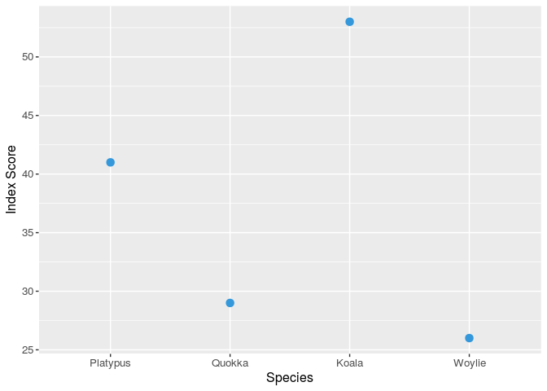
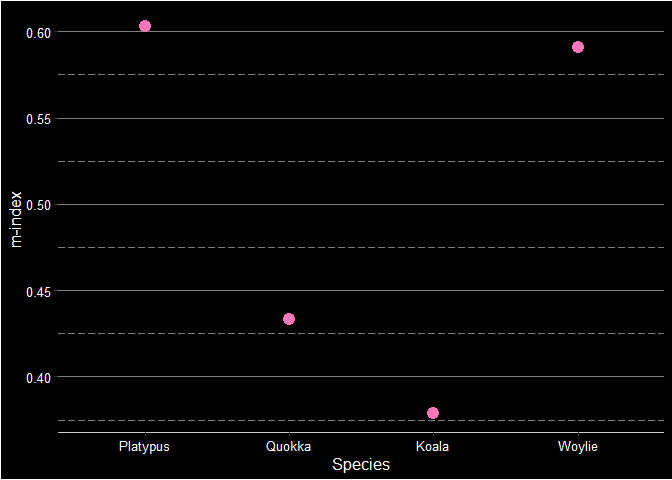

# specieshindex

[](https://CRAN.R-project.org/package=specieshindex)

[](https://codecov.io/gh/jessicatytam/specieshindex)
[]()

`specieshindex` is a package that aims to gauge scientific influence of
different species mainly using the *h*-index.

## Installation

To get this package to work, make sure you have the following packages
installed.

``` r
# Installation from GitHub
install.packages("rscopus")
install.packages("taxize")
install.packages("XML")
install.packages("httr")
install.packages("dplyr")
devtools::install_github("jessicatytam/specieshindex", force = TRUE, build_vignettes = FALSE)

# Load the library
library(specieshindex)
```

You can find the vignette
[here](https://github.com/jessicatytam/specieshindex/blob/master/vignettes/vignette.pdf)
for more detailed instructions and the full list of functions
[here](https://github.com/jessicatytam/specieshindex/blob/master/specieshindex_0.0.1.pdf).

## Before you start

### :mega: Connecting to Scopus

**Make sure you are connected to the internet via institutional access
or acquire a VPN from your institution if you are working from home.**
Alternatively, if you are a subscriber of Scopus already, you can ignore
this step.

### :key: Getting an API key

To connect and download citation information from Scopus legally, you
will **absolutely need** an API key. Here are the steps to obtain the
key.

1.  Go to <https://dev.elsevier.com/> and click on the button `I want an
    API key`.
2.  Create an account and log in.
3.  Go to the `My API Key` tab on top of the page and click `Create API
    Key`.
4.  Read the legal documents and check the boxes.

### :dart: Additional keywords

The Count and Fetch functions allow the addition of keywords using
Boolean operators to restrict the domain of the search. Although you can
simply use keywords such as “conservation”, you will find that using
“conserv\*” will yield more results. The “\*” (or wildcard) used here
searches for any words with the prefix “conserv”, e.g. conservation,
conserve, conservatory, etc. Find out more about search language
[here](https://guides.library.illinois.edu/c.php?g=980380&p=7089537) and
[here](http://schema.elsevier.com/dtds/document/bkapi/search/SCOPUSSearchTips.htm).

### :boar: Synonyms

Some species have had their classification changed in the past,
resulting in multiple binomial names and synonyms. Synonyms can be added
to the search strings to get the maximum hits. Remember to add
**double** quotation marks to the synonyms, otherwise you might run into
getting the error `Bad Request (HTTP 400)`. An example is shown below to
demonstrate how to put double quotation marks in the character string.

## Examples

Here is a quick demonstration of how the package works.

### :abacus: Counting citation records

If you are only interested in knowing how many publications there are on
Scopus, you can run the Count functions. Use `CountSpT()` for title only
or `CountSpTAK()` for title+abstract+keywords.

``` r
#API key
API <- "your_api_key_from_scopus"

# Count citation data
CountSpT("Bettongia", "penicillata", APIkey = API)
CountSpTAK("Bettongia", "penicillata", APIkey = API)

# Example including additional keywords
CountSpTAK("Phascolarctos", "cinereus", additionalkeywords = "(consrv* OR protect* OR reintrod* OR restor*)", APIkey = API)
#search string: TITLE-ABS-KEY("Phascolarctos cinereus" AND (consrv* OR protect* OR reintrod* OR restor*))

# Example including synonyms
CountSpT("Osphranter", "rufus", synonyms = '"Macropus rufus"', additionalkeywords = "conserv*", APIkey = API)
#search string: TITLE(("Osphranter rufus" OR "Macropus rufus") AND conserv*)
```

### :fishing\_pole\_and\_fish: Extracting citaiton records

In order to calculate the indices, you will need to download the
citation records. The parameters of the Count and Fetch functions are
exactly the same. Let’s say you want to compare the species h-index of a
few marsupials. First, you would need to download the citation
information using either `FetchSpT()` for title only or `FetchSpTAK()`
for title+abstract+keywords. Remember to use binomial names.

``` r
# Extract citation data
Woylie <- FetchSpTAK("Bettongia", "penicillata", APIkey = API)
Quokka <- FetchSpTAK("Setonix", "brachyurus", APIkey = API)
Platypus <- FetchSpTAK("Ornithorhynchus", "anatinus", APIkey = API)
Koala <- FetchSpTAK("Phascolarctos", "cinereus", APIkey = API)
```

### :bar\_chart: Index calculation and plotting

Now that you have the data, you can use the `Allindices()` function to
create a dataframe that shows their indices.

``` r
# Calculate indices
W <- Allindices(Woylie, genus = "Bettongia", species = "penicillata")
Q <- Allindices(Quokka, genus = "Setonix", species = "brachyurus")
P <- Allindices(Platypus, genus = "Ornithorhynchus", species = "anatinus")
K <- Allindices(Koala, genus = "Phascolarctos", species = "cinereus")

CombineSp <- rbind(W, Q, P, K) #combining the citation records
CombineSp
```

    ##              genus_species     species           genus publications citations
    ## 1    Bettongia_penicillata penicillata       Bettongia          113      1903
    ## 2       Setonix_brachyurus  brachyurus         Setonix          242      3427
    ## 3 Ornithorhynchus_anatinus    anatinus Ornithorhynchus          321      6365
    ## 4   Phascolarctos_cinereus    cinereus   Phascolarctos          773     14291
    ##   journals articles reviews years_publishing  h     m i10 h5
    ## 1       55      110       3               44 26 0.591  54  7
    ## 2      107      237       5               67 29 0.433 121  3
    ## 3      153      308      13               68 41 0.603 177  7
    ## 4      227      744      29              140 53 0.379 427 13

Once you are happy with your dataset, you can make some nice plots.
Using `ggplot2`, we can compare the *h*-index and the total citations.

``` r
# h-index
library(ggplot2)
ggplot(CombineSp, aes(x = species,
                      y = h)) +
  geom_point(size = 3,
             colour = "#6fc6f8") +
  labs(x = "Species",
       y = "h-index") +
  scale_x_discrete(labels = c("Platypus", "Quokka", "Koala", "Woylie")) +
  ylim(25, 55) +
  theme(axis.title = element_text(size = 12,
                                  colour = "white"),
        axis.text = element_text(size = 10,
                                 colour = "white"),
        axis.line.x = element_line(colour = "grey80"),
        plot.background = element_rect(fill = "black"),
        panel.background = element_rect(fill = "black"),
        panel.grid.major.y = element_line(colour = "grey50"),
        panel.grid.minor.y = element_line(colour = "grey50",
                                          linetype = "longdash"),
        panel.grid.major.x = element_blank(),
        panel.grid.minor.x = element_blank(),
        legend.position = "none")
```



**Figure 1.** The *h*-index of the Woylie, Quokka, Platypus, and Koala.

<br/>

``` r
# Total citations
ggplot(CombineSp, aes(x = species,
                      y = citations)) +
  geom_point(size = 3,
             colour = "#f976bb") +
  labs(x = "Species",
       y = "Total citations") +
  scale_x_discrete(labels = c("Platypus", "Quokka", "Koala", "Woylie")) + 
  theme(axis.title = element_text(size = 12,
                                  colour = "white"),
        axis.text = element_text(size = 10,
                                 colour = "white"),
        axis.line.x = element_line(colour = "grey80"),
        plot.background = element_rect(fill = "black"),
        panel.background = element_rect(fill = "black"),
        panel.grid.major.y = element_line(colour = "grey50"),
        panel.grid.minor.y = element_line(colour = "grey50",
                                          linetype = "longdash"),
        panel.grid.major.x = element_blank(),
        panel.grid.minor.x = element_blank(),
        legend.position = "none")
```



**Figure 2.** The total number of citations of the publications on the
Woylie, Quokka, Platypus, and Koala.

<br/>

## :paw\_prints: Roadmap

  - [ ] Add functions to query Web of Science
  - [ ] Add functions to query Lens
