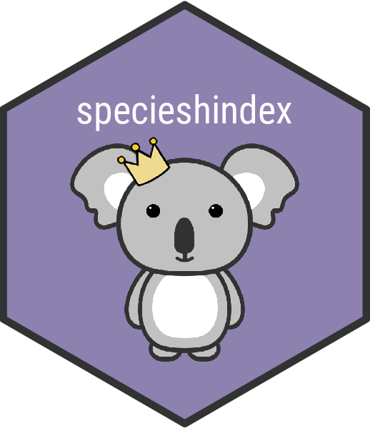

# specieshindex

[](https://CRAN.R-project.org/package=specieshindex)

`r badger::badge_codecov("jessicatytam/specieshindex")`
[]()

`specieshindex` is a package that aims to gauge scientific influence of different species mainly using the *h*-index.

## Installation

To get this package to work, make sure you have the following packages installed.

```{r, eval=FALSE}
# Installation from GitHub
install.packages("rscopus")
install.packages("taxize")
install.packages("XML")
install.packages("httr")
install.packages("dplyr")
devtools::install_github("jessicatytam/specieshindex", force = TRUE, build_vignettes = FALSE)

# Load the library
library(specieshindex)
```

You can find the vignette [here](https://github.com/jessicatytam/specieshindex/blob/master/vignettes/vignette.pdf) for more detailed instructions and the full list of functions [here](https://github.com/jessicatytam/specieshindex/blob/master/specieshindex_0.0.1.pdf).

## Scopus

### Getting an API key

To connect and download citation information from Scopus legally, you will **absolutely** need an API key. Here are the steps to obtain the key.

1. Go to https://dev.elsevier.com/ and click on the button `I want an API key`.
2. Create an account and log in.
3. Go to the `My API Key` tab on top of the page and click `Create API Key`.
4. Read the legal documents and check the boxes. 

### Connecting to Scopus

Make sure you are connected to the internet via institutional access or acquire a VPN from your institution if you are working from home. Alternatively, the functions will also run if you are already a subscriber of Scopus.

### Query string

The function `CountSpTAKexp()` allows the addition of 1 keyword to restricted the domain of the publications of the species. Although you can simply use keywords such as "conservation", you will find that using "conserv\*" will yield more results. The "\*" (or wildcard) used here searches for any words with the prefix "conserv", e.g. conservation, conserve, conservatory, etc. Find out more about search language [here](https://guides.library.illinois.edu/c.php?g=980380&p=7089537) and [here](http://schema.elsevier.com/dtds/document/bkapi/search/SCOPUSSearchTips.htm).

## Quick example

Here is a quick demonstration of how the package works. Let's say you want to compare the species h-index of a few marsupials. First, you would need to download the citation information using either `FetchSpT()` for title only or `FetchSpTAK()` for title+abstract+keywords. Remember to use binomial names.

```{r, include=FALSE}
devtools::load_all(".")
```

```{r, eval=FALSE}
# Extract citation data
Woylie <- FetchSpTAK("Bettongia", "penicillata", APIkey = "API key")
Quokka <- FetchSpTAK("Setonix", "brachyurus", APIkey = "API key")
Platypus <- FetchSpTAK("Ornithorhynchus", "anatinus", APIkey = "API key")
Koala <- FetchSpTAK("Phascolarctos", "cinereus", APIkey = "API key")
```

Now that you have the data, you can use the `Allindices()` function to create a dataframe that shows their indices.

```{r, message=FALSE, warning=FALSE}
# Calculate indices
W <- Allindices(Woylie, genus = "Bettongia", species = "penicillata")
Q <- Allindices(Quokka, genus = "Setonix", species = "brachyurus")
P <- Allindices(Platypus, genus = "Ornithorhynchus", species = "anatinus")
K <- Allindices(Koala, genus = "Phascolarctos", species = "cinereus")

CombineSp <- rbind(W, Q, P, K) #combining the citation records
CombineSp
```

Once you are happy with your dataset, you can make some nice plots. Using `ggplot2`, we can compare the *h*-index and the total citations.

```{r, cache=TRUE, fig.align='center'}
# h-index
library(ggplot2)
ggplot(CombineSp, aes(x = species)) +
  geom_point(aes(y = h,
                 colour = "H-index"),
             size = 3) +
  labs(x = "Species",
       y = "Index Score",
       colour = "Index") +
  scale_x_discrete(labels = c("Platypus", "Quokka", "Koala", "Woylie")) +
  scale_colour_manual(values = c("H-index" = "#3498DB")) +
  theme(plot.title = element_text(size = 14, face = "bold"),
        axis.title = element_text(size = 12),
        axis.text = element_text(size = 10),
        legend.position = "none")
```

**Figure 1.** The *h*-index of the Woylie, Quokka, Platypus, and Koala.

```{r, cache=TRUE, fig.align='center'}
# Total citations
ggplot(CombineSp, aes(x = species)) +
geom_point(aes(y = citations,
               colour = "Citations"),
           size = 3) +
labs(x = "Species",
     y = "Total citations",
     colour = "Index") +
scale_x_discrete(labels = c("Platypus", "Quokka", "Koala", "Woylie")) + 
scale_colour_manual(values = c("Citations"  = "#2874A6")) +
theme(plot.title = element_text(size = 14, face = "bold"),
      axis.title = element_text(size = 12),
      axis.text = element_text(size = 10),
      legend.position = "none")
```

**Figure 2.** The total number of citations of the publications on the Woylie, Quokka, Platypus, and Koala.
