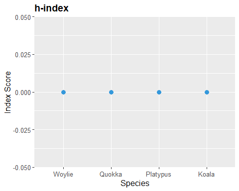

# Summary

Conservation efforts of species rely heavily on their existing research. Reintroduction projects, pest eradication, breeding programs, habitat restoration, etc. all require sound scientific knowledge for their proper implementation. Unfortunately, there is serious taxonomic bias [@bonnet_taxonomic_2002] in ecological research, such that certain species receive more research interest [@donaldson_taxonomic_2017; @dos2020drivers; @seddon_taxonomic_2005; @titley_scientific_2017; @troudet_taxonomic_2017]. Over time, it has widened the knowledge gaps of species and increased the patchiness of fundamental knowledge. This issue needs to be addressed by the scientific community as a whole to reduce the disparity of research and ensure its even distribution.

To remedy the problem of taxonomic bias, we must first quantify research interest in the species' publications. The challenge presented here is the lack of existing methods to quantify species-level research interest. Although this is a well-known problem, the few previous studies had only compared biases between higher taxonomic levels. Results showed that vertebrates in general attracted more research than invertebrates [@donaldson_taxonomic_2017; @eisenhauer2019recognizing; @titley_scientific_2017; @troudet_taxonomic_2017]. While vertebrate clades, i.e. Mammalia and Aves, had more related publications [@donaldson_taxonomic_2017; @titley_scientific_2017; @troudet_taxonomic_2017]. Species-specific investigations are vital in avoiding the over-generalisation of groups since variations in research interest may occur within clades. 

# Statement of need

The aim of specieshindex is to standardise the use of *h*-index in the context of measuring research popularity of species. The *h*-index was first introduced by Hirsch [@hirsch_index_2005] to compare the influence of academics [@hirsch2014meaning]. It is obtained with the formula *h* = total publications (*n*) that have at least been cited *n* times, after ranking the publications in a descending order by their number of citations. The *h*-index is now also being used to measure the research influence of the publications of different academic disciplines [@banks_extension_2006; @harzing_google_2016], journals [@braun_hirsch-type_2006], countries [@csajbok_hirsch-index_2007], species of animals [@fleming_good_2016; @mckenzie_which_2015; @robertson_scientific_2015] and pathogens [@cox_comparison_2016]. Using the *h*-index, specieshindex calculates the *h*-index of the publication of different species. There are currently 3 published studies [@fleming_good_2016; @mckenzie_which_2015; @robertson_scientific_2015] that adopted the species *h*-index as a measure of the species' research popularity. However, there are no standardised methods to achieve this at the moment.

specieshindex connects to the Scopus database and extracts citation records for analysis. It does it via the Scopus API, and returns information including the publication title, number of citations, publication type, etc. The binomial name of the species name must be used instead of their common names since they are less specific and can refer to larger groups of species. The 2 types of functions that connects to Scopus can be distinguished by their suffixes "T" and "TAK". "T" functions only extracts publications with the species' name in the title whereas "TAK" in the title, abstract and keywords. In the case that the user only wants to know the number of publications of a particular species, the `CountSpT()` and `CountSpTAK()` functions simply returns the total count without extracting any data. Apart from the *h*-index, specieshindex can also compute for other indices such as the *m*-index and the i10 index, which are also used to gauge research influence of authors. In this case, it will be used to gauge the research influence of species publication.

# Implementation

The following packages are required for specieshindex to work.
```{r}
# Installation from GitHub
install.packages("rscopus")
install.packages("taxize")
install.packages("XML")
install.packages("httr")
install.packages("dplyr")
install.packages("rlang")
devtools::install_github("jessicatytam/specieshindex", force = TRUE, build_vignettes = TRUE)

# Loading the libraries
library(rscopus)
library(taxize)
library(XML)
library(httr)
library(specieshindex)
```

## Obtaining Scopus API key

An API key from Scopus is required to extract citation records from their database legally. Here are the steps to obtain the key.

1. Go to https://dev.elsevier.com/ and click on the button `I want an API key`.
2. Create an account and log in.
3. Go to the `My API Key` tab on top of the page and click `Create API Key`.
4. Read the legal documents and check the boxes. 

## Example

The species' binomial name is required to download the citation records from Scopus.

```{r}
# Extract citation data
Woylie <- FetchSpTAK("Bettongia", "penicillata", myAPI)
Quokka <- FetchSpTAK("Setonix", "brachyurus", myAPI)
Platypus <- FetchSpTAK("Ornithorhynchus", "anatinus", myAPI)
Koala <- FetchSpTAK("Phascolarctos", "cinereus", myAPI)
```

These four datasets are readily available within the package. The API key is not required for the calculation of the indices. An efficient way to calculate all of the indices is to use the function `Allindices()`. The plot in Figure 1 illustrates one of the many ways to visualise the indices obtained below.

```{r}
# Calculate indices
W <- Allindices(Woylie, genus = "Bettongia", species = "penicillata")
Q <- Allindices(Quokka, genus = "Setonix", species = "brachyurus")
P <- Allindices(Platypus, genus = "Ornithorhynchus", species = "anatinus")
K <- Allindices(Koala, genus = "Phascolarctos", species = "cinereus")

# Combine the citation records into a single dataframe
CombineSp <- rbind(W, Q, P, K)
CombineSp
```

    ##              genus_species     species           genus publications citations
    ## 1    Bettongia_penicillata penicillata       Bettongia          113      1903
    ## 2       Setonix_brachyurus  brachyurus         Setonix          242      3427
    ## 3 Ornithorhynchus_anatinus    anatinus Ornithorhynchus          321      6365
    ## 4   Phascolarctos_cinereus    cinereus   Phascolarctos          773     14291
    ##   journals articles reviews years_publishing  h     m i10 h5
    ## 1       55      110       3               43 26 0.605  54  7
    ## 2      107      237       5               66 29 0.439 121  4
    ## 3      153      308      13               67 41 0.612 177  7
    ## 4      227      744      29              139 53 0.381 427 14

\


\center  

__Figure 1.__ The *h*-index of the Woylie, Quokka, Platypus, and Koala.

\

# Acknowledgements

I acknowledge the contributions from my supervisors Dr. Malgorzata (Losia) Lagisz, Professor Shinichi Nakagawa, and Associate Professor Will Cornwell.

# References