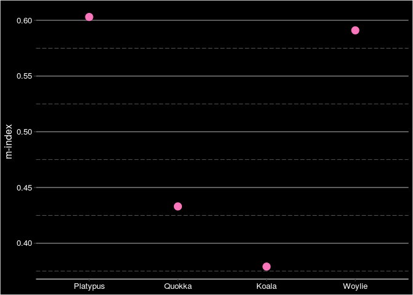

# Summary

Conservation efforts rely heavily on existing research. Species reintroduction projects, pest eradication, breeding programs and habitat restoration, all require sound scientific knowledge for their implementations. Unfortunately, there is serious taxonomic bias [@bonnet_taxonomic_2002] in ecological, evolutionary and conservation research, such that certain species receive more research interest than the others [@donaldson_taxonomic_2017; @dos2020drivers; @seddon_taxonomic_2005; @titley_scientific_2017; @troudet_taxonomic_2017]. Over time, taxonomic bias in research has widened the knowledge gaps between species and increased the patchiness of our knowledge. The scientific community now need to be able to quantify knowledge gaps to identify and address such gaps, and to direct research efforts where they are most needed for conservation.  

Many studies have previously quantified taxonomic bias among species of plants and animals [@adamo2021; @donaldson_taxonomic_2017; @dos2020drivers; @ducatez2019; @fleming_good_2016; @mckenzie_which_2015; @robertson_scientific_2015; @schiesari2007; @tensen2018; @trimble_aarde2010]. Most of these studies evaluated small groups of species, no more than a few hundred. Additionally, the majority of the studies used publication or citation counts to identify the bias. However, publication count can only capture the total research productivity. While citation count can capture research interest, it can be easily inflated by highly cited papers [@hirsch_index_2005], without equally considering each publication. Here, we propose the use of Hirsch's *h*-index [@hirsch_index_2005] as a better alternative in quantifying research interest of species.

# Statement of need

`specieshindex` aims to make simpler the calculation of *h*-index in the context of measuring popularity of species in the scientific literature. The *h*-index was introduced by Hirsch [@hirsch_index_2005] to compare the influence of academics with a single number [@hirsch2014meaning]. It is calculated with the formula *h* = total publications (*n*) that have at least been cited *n* times, after ranking the publications in a descending order by their number of citations. The *h*-index is now also being used to measure the research interest and influence of the publications of different academic disciplines [@banks_extension_2006; @harzing_google_2016], journals [@braun_hirsch-type_2006], countries [@csajbok_hirsch-index_2007], species of animals [@fleming_good_2016; @mckenzie_which_2015; @robertson_scientific_2015], plants [@adamo2021], and pathogens [@cox_comparison_2016]. `specieshindex` calculates the *h*-index of different species and genera with their bibliometric information.

The package `specieshindex` connects to the Scopus, Web of Science, and Bielefeld Academic Search Engine (BASE) databases (interdisciplinary broad-range database of academic literature) and extracts citation records of relevant publications, as identified via a search query. It returns blibliometric information including the publication title, number of citations, publication type, etc. The binomial or genus names of the species should be used in the search query, instead of their common names, since the latter are less specific and can refer to larger groups of species. Examples of such include 'wombat', and 'echidna'. 

There are two types of functions that connect to the literature databases. The count functions, e.g. `CountSpT()` and `CountSpTAK()`, return the total publication count without extracting any citation records. Whereas the fetch functions, e.g. `FetchSpT()` and `FetchSpTAK()`, extract citation records for index calculations. These functions are distinguished by their suffixes "T" and "TAK". "T" function only finds publications with the species' name in the publication title, whereas "TAK" functions query the title, abstract and keywords. Apart from the *h*-index, `specieshindex` can also compute other established influence indices, including the *h5* index, the *m*-index, and the *i10* index. 

# Implementation

The following packages are required for specieshindex to work.
```{r}
# Installation from GitHub
install.packages("rscopus")
install.packages("wosr")
install.packages("rbace")
install.packages("taxize")
install.packages("XML")
install.packages("jsonlite")
install.packages("httr")
install.packages("dplyr")
install.packages("data.table")
install.packages("tidyr")
devtools::install_github("jessicatytam/specieshindex", force = TRUE, build_vignettes = TRUE)

# Load the library
library(specieshindex)
```

## Connecting to Scopus

An API key from Scopus is required to extract citation records from their database legally. Here are the steps to obtain the key.

1. Go to https://dev.elsevier.com/ and click on the button `I want an API key`.
2. Create an account and log in.
3. Go to the `My API Key` tab on top of the page and click `Create API Key`.
4. Read the legal documents and check the boxes. 

Afterwards, run the following line of code to gain access to the Scopus database:

```{r}
# Setup API key
apikey <- "your_api_key_from_scopus"
```

## Connecting to Web of Science

Users do not need a key to extract data from Web of Science if you are using this package from your institution's location. To gain access to the Web of Science database, run the following line of code: 

```{r}
# Setup session ID
sid <- auth(username = NULL, password = NULL)
```

## Connecting to BASE

Having a whitelisted IP address is essential when gaining access to the BASE database, which users can accomplish at https://www.base-search.net/about/en/contact.php. A token or API key, however, is not required. Only count functions, e.g. `CountSpT()` and `CountSpTAK()`, are available as BASE does not return citation counts. Hence, index calculations will also be unavailable using this database. 

## Example

The following example will demonstrate the calculation of various indices with citation records from Scopus. The species' binomial name (i.e. Latin name) or genus name (using functions such as `FetchGenusT()`) is required for the extraction:

```{r}
# Extract citation data
Woylie <- FetchSpTAK(db = "scopus', genus = "Bettongia", species = "penicillata")
Quokka <- FetchSpTAK(db = "scopus', genus = "Setonix", species = "brachyurus")
Platypus <- FetchSpTAK(db = "scopus', genus = "Ornithorhynchus", species = "anatinus")
Koala <- FetchSpTAK(db = "scopus', genus = "Phascolarctos", species = "cinereus")
```

These four datasets are readily available within the package. An efficient way to calculate all of the indices at once is to use the function `Allindices()`. 

```{r}
# Calculate indices
W <- Allindices(data = Woylie, genus = "Bettongia", species = "penicillata")
Q <- Allindices(data = Quokka, genus = "Setonix", species = "brachyurus")
P <- Allindices(data = Platypus, genus = "Ornithorhynchus", species = "anatinus")
K <- Allindices(data = Koala, genus = "Phascolarctos", species = "cinereus")

# Combine citation records into a single dataframe
CombineSp <- rbind(W, Q, P, K)
CombineSp
```

    ##              genus_species     species           genus publications citations
    ## 1    Bettongia_penicillata penicillata       Bettongia          113      1903
    ## 2       Setonix_brachyurus  brachyurus         Setonix          242      3427
    ## 3 Ornithorhynchus_anatinus    anatinus Ornithorhynchus          321      6365
    ## 4   Phascolarctos_cinereus    cinereus   Phascolarctos          773     14291
    ##   journals articles reviews years_publishing  h     m i10 h5
    ## 1       55      110       3               43 26 0.605  54  7
    ## 2      107      237       5               66 29 0.439 121  4
    ## 3      153      308      13               67 41 0.612 177  7
    ## 4      227      744      29              139 53 0.381 427 14

### Plots

This package has 2 built-in plotting functions. They are `plotAllindices()` and `plotPub()`. `plotAllindices()` plots the *h*-index, *m*-index, *i10* index, and *h5* index in the same plot.

```{r}
# Plot the indices
plotAllindices(CombineSp)
```

 

**Figure 1.** The *h*-index, *m*-index, *i10* index, and *h5* index of the Woylie, Platypus, Koala, and Quokka.

`plotPub()` plots the total publications per year of species, after extracting the year and frequency of publication with the `getYear()` function.

```{r}
# Extract year and frequency
extract_year_W <- getYear(data = Woylie, genus = "Bettongia", species = "penicillata")
extract_year_Q <- getYear(data = Quokka, genus = "Setonix", species = "brachyurus")
extract_year_P <- getYear(data = Platypus, genus = "Ornithorhynchus", species = "anatinus")
extract_year_K <- getYear(data = Koala, genus = "Phascolarctos", species = "cinereus")

# Combine year and frequency into a single dataframe
Combine_pub <- rbind(extract_year_W, extract_year_Q, extract_year_P, extract_year_K)

# Plot the number of publications by year
plotPub(Combine_pub)
```

 

**Figure 2.** The total number of publications per year of the Woylie, Platypus, Koala, and Quokka.

# Acknowledgements

I acknowledge the contributions of the authors of the dependence packages: `rscopus`, `wosr`, `rbace`, `taxize`, `XML`, `jsonlite`, `httr`, `dplyr`, `data.table`, `tidyr`. `specieshindex` is enabled by Scopus, Web of Science, and BASE [@pieper_summann2006].

# References
